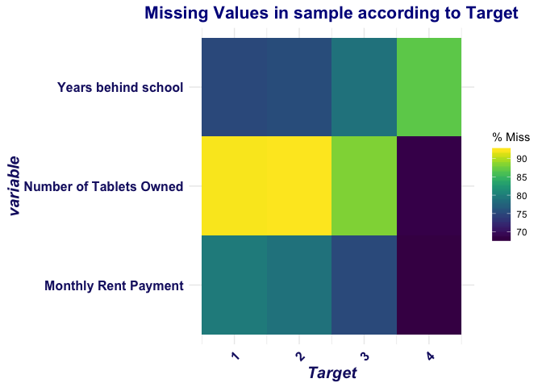

ML Poverty Level Predictions
================
Marine Colon de Franciosi
7/10/2019

**Goal:** applying machine learning techniques in order to improve poverty level prediction using Costa Rican household survey data provided by the Inter-American Development Bank containing information on households' observable characteristics.

Understanding the Problem:
==========================

We are looking to improve the accuracy of algortihms identifying the poorest households as eligible for cash transfers or other forms of social assistance.

**Defining the problem:**

This is a supervised multi-class classification machine learning problem:

-   Supervised: provided with the labels for the training data
-   Multi-class classification: Labels are discrete values with 4 classes

**Objective:**

The objective is to predict poverty on a household level. We are given data on the individual level with each individual having unique features but also information about their household. In order to create a dataset for the task, we'll have to perform some aggregations of the individual data for each household. Moreover, we have to make a prediction for every individual in the test set, but "ONLY the heads of household are used in scoring" which means we want to predict poverty on a household basis.

Let's dive in and explore the data.

Set-Up:
=======

**Loading Packages:**

``` r
library(pacman)
p_load(tidyverse,
       grid,
       gridExtra,
       kableExtra, 
       knitr,
       ggthemes,
       caret,
       class, 
       naniar,
       scales,
       UpSetR)
```

**Loading Data**

``` r
sample <- read.csv("sample.csv")
codebook <- read.csv("codebook.csv")
```

**dimensions of our sample:**

``` r
dim(sample)
```

    ## [1] 9557  143

Our sample has 9557 observations and 143 variables

Each row represents one individual and each column is a feature, either unique to the individual, or for the household of the individual. The training set has one additional column, Target, which represents the poverty level on a 1-4 scale and is the label for the competition. A value of 1 is the most extreme poverty.

**Let's take a look at the variables in the sample:**

``` r
colnames(codebook) <- c("Variable Name", "Variable Description")
kable(codebook) %>% 
  kable_styling(c("striped", "bordered"))
```

<table class="table table-striped table-bordered" style="margin-left: auto; margin-right: auto;">
<thead>
<tr>
<th style="text-align:left;">
Variable Name
</th>
<th style="text-align:left;">
Variable Description
</th>
</tr>
</thead>
<tbody>
<tr>
<td style="text-align:left;">
v2a1
</td>
<td style="text-align:left;">
Monthly rent payment
</td>
</tr>
<tr>
<td style="text-align:left;">
hacdor
</td>
<td style="text-align:left;">
=1 Overcrowding by bedrooms
</td>
</tr>
<tr>
<td style="text-align:left;">
rooms
</td>
<td style="text-align:left;">
number of all rooms in the house
</td>
</tr>
<tr>
<td style="text-align:left;">
hacapo
</td>
<td style="text-align:left;">
=1 Overcrowding by rooms
</td>
</tr>
<tr>
<td style="text-align:left;">
v14a
</td>
<td style="text-align:left;">
=1 has toilet in the household
</td>
</tr>
<tr>
<td style="text-align:left;">
refrig
</td>
<td style="text-align:left;">
=1 if the household has refrigerator
</td>
</tr>
<tr>
<td style="text-align:left;">
v18q
</td>
<td style="text-align:left;">
owns a tablet
</td>
</tr>
<tr>
<td style="text-align:left;">
v18q1
</td>
<td style="text-align:left;">
number of tablets household owns
</td>
</tr>
<tr>
<td style="text-align:left;">
r4h1
</td>
<td style="text-align:left;">
Males younger than 12 years of age
</td>
</tr>
<tr>
<td style="text-align:left;">
r4h2
</td>
<td style="text-align:left;">
Males 12 years of age and older
</td>
</tr>
<tr>
<td style="text-align:left;">
r4h3
</td>
<td style="text-align:left;">
Total males in the household
</td>
</tr>
<tr>
<td style="text-align:left;">
r4m1
</td>
<td style="text-align:left;">
Females younger than 12 years of age
</td>
</tr>
<tr>
<td style="text-align:left;">
r4m2
</td>
<td style="text-align:left;">
Females 12 years of age and older
</td>
</tr>
<tr>
<td style="text-align:left;">
r4m3
</td>
<td style="text-align:left;">
Total females in the household
</td>
</tr>
<tr>
<td style="text-align:left;">
r4t1
</td>
<td style="text-align:left;">
persons younger than 12 years of age
</td>
</tr>
<tr>
<td style="text-align:left;">
r4t2
</td>
<td style="text-align:left;">
persons 12 years of age and older
</td>
</tr>
<tr>
<td style="text-align:left;">
r4t3
</td>
<td style="text-align:left;">
Total persons in the household
</td>
</tr>
<tr>
<td style="text-align:left;">
tamhog
</td>
<td style="text-align:left;">
size of the household
</td>
</tr>
<tr>
<td style="text-align:left;">
tamviv
</td>
<td style="text-align:left;">
TamViv
</td>
</tr>
<tr>
<td style="text-align:left;">
escolari
</td>
<td style="text-align:left;">
years of schooling
</td>
</tr>
<tr>
<td style="text-align:left;">
rez\_esc
</td>
<td style="text-align:left;">
Years behind in school
</td>
</tr>
<tr>
<td style="text-align:left;">
hhsize
</td>
<td style="text-align:left;">
household size
</td>
</tr>
<tr>
<td style="text-align:left;">
paredblolad
</td>
<td style="text-align:left;">
=1 if predominant material on the outside wall is block or brick
</td>
</tr>
<tr>
<td style="text-align:left;">
paredzocalo
</td>
<td style="text-align:left;">
=1 if predominant material on the outside wall is socket (wood, zinc or absbesto
</td>
</tr>
<tr>
<td style="text-align:left;">
paredpreb
</td>
<td style="text-align:left;">
=1 if predominant material on the outside wall is prefabricated or cement
</td>
</tr>
<tr>
<td style="text-align:left;">
pareddes
</td>
<td style="text-align:left;">
=1 if predominant material on the outside wall is waste material
</td>
</tr>
<tr>
<td style="text-align:left;">
paredmad
</td>
<td style="text-align:left;">
=1 if predominant material on the outside wall is wood
</td>
</tr>
<tr>
<td style="text-align:left;">
paredzinc
</td>
<td style="text-align:left;">
=1 if predominant material on the outside wall is zink
</td>
</tr>
<tr>
<td style="text-align:left;">
paredfibras
</td>
<td style="text-align:left;">
=1 if predominant material on the outside wall is natural fibers
</td>
</tr>
<tr>
<td style="text-align:left;">
paredother
</td>
<td style="text-align:left;">
=1 if predominant material on the outside wall is other
</td>
</tr>
<tr>
<td style="text-align:left;">
pisomoscer
</td>
<td style="text-align:left;">
=1 if predominant material on the floor is mosaic, ceramic, terrazo
</td>
</tr>
<tr>
<td style="text-align:left;">
pisocemento
</td>
<td style="text-align:left;">
=1 if predominant material on the floor is cement
</td>
</tr>
<tr>
<td style="text-align:left;">
pisoother
</td>
<td style="text-align:left;">
=1 if predominant material on the floor is other
</td>
</tr>
<tr>
<td style="text-align:left;">
pisonatur
</td>
<td style="text-align:left;">
=1 if predominant material on the floor is natural material
</td>
</tr>
<tr>
<td style="text-align:left;">
pisonotiene
</td>
<td style="text-align:left;">
=1 if no floor at the household
</td>
</tr>
<tr>
<td style="text-align:left;">
pisomadera
</td>
<td style="text-align:left;">
=1 if predominant material on the floor is wood
</td>
</tr>
<tr>
<td style="text-align:left;">
techozinc
</td>
<td style="text-align:left;">
=1 if predominant material on the roof is metal foil or zink
</td>
</tr>
<tr>
<td style="text-align:left;">
techoentrepiso
</td>
<td style="text-align:left;">
=1 if predominant material on the roof is fiber cement, mezzanine
</td>
</tr>
<tr>
<td style="text-align:left;">
techocane
</td>
<td style="text-align:left;">
=1 if predominant material on the roof is natural fibers
</td>
</tr>
<tr>
<td style="text-align:left;">
techootro
</td>
<td style="text-align:left;">
=1 if predominant material on the roof is other
</td>
</tr>
<tr>
<td style="text-align:left;">
cielorazo
</td>
<td style="text-align:left;">
=1 if the house has ceiling
</td>
</tr>
<tr>
<td style="text-align:left;">
abastaguadentro
</td>
<td style="text-align:left;">
=1 if water provision inside the dwelling
</td>
</tr>
<tr>
<td style="text-align:left;">
abastaguafuera
</td>
<td style="text-align:left;">
=1 if water provision outside the dwelling
</td>
</tr>
<tr>
<td style="text-align:left;">
abastaguano
</td>
<td style="text-align:left;">
=1 if no water provision
</td>
</tr>
<tr>
<td style="text-align:left;">
public
</td>
<td style="text-align:left;">
=1 electricity from CNFL, ICE, ESPH/JASEC
</td>
</tr>
<tr>
<td style="text-align:left;">
planpri
</td>
<td style="text-align:left;">
=1 electricity from private plant
</td>
</tr>
<tr>
<td style="text-align:left;">
noelec
</td>
<td style="text-align:left;">
=1 no electricity in the dwelling
</td>
</tr>
<tr>
<td style="text-align:left;">
coopele
</td>
<td style="text-align:left;">
=1 electricity from cooperative
</td>
</tr>
<tr>
<td style="text-align:left;">
sanitario1
</td>
<td style="text-align:left;">
=1 no toilet in the dwelling
</td>
</tr>
<tr>
<td style="text-align:left;">
sanitario2
</td>
<td style="text-align:left;">
=1 toilet connected to sewer or cesspool
</td>
</tr>
<tr>
<td style="text-align:left;">
sanitario3
</td>
<td style="text-align:left;">
=1 toilet connected to septic tank
</td>
</tr>
<tr>
<td style="text-align:left;">
sanitario5
</td>
<td style="text-align:left;">
=1 toilet connected to black hole or letrine
</td>
</tr>
<tr>
<td style="text-align:left;">
sanitario6
</td>
<td style="text-align:left;">
=1 toilet connected to other system
</td>
</tr>
<tr>
<td style="text-align:left;">
energcocinar1
</td>
<td style="text-align:left;">
=1 no main source of energy used for cooking (no kitchen)
</td>
</tr>
<tr>
<td style="text-align:left;">
energcocinar2
</td>
<td style="text-align:left;">
=1 main source of energy used for cooking electricity
</td>
</tr>
<tr>
<td style="text-align:left;">
energcocinar3
</td>
<td style="text-align:left;">
=1 main source of energy used for cooking gas
</td>
</tr>
<tr>
<td style="text-align:left;">
energcocinar4
</td>
<td style="text-align:left;">
=1 main source of energy used for cooking wood charcoal
</td>
</tr>
<tr>
<td style="text-align:left;">
elimbasu1
</td>
<td style="text-align:left;">
=1 if rubbish disposal mainly by tanker truck
</td>
</tr>
<tr>
<td style="text-align:left;">
elimbasu2
</td>
<td style="text-align:left;">
=1 if rubbish disposal mainly by botan hollow or buried
</td>
</tr>
<tr>
<td style="text-align:left;">
elimbasu3
</td>
<td style="text-align:left;">
=1 if rubbish disposal mainly by burning
</td>
</tr>
<tr>
<td style="text-align:left;">
elimbasu4
</td>
<td style="text-align:left;">
=1 if rubbish disposal mainly by throwing in an unoccupied space
</td>
</tr>
<tr>
<td style="text-align:left;">
elimbasu5
</td>
<td style="text-align:left;">
=1 if rubbish disposal mainly by throwing in river, creek or sea
</td>
</tr>
<tr>
<td style="text-align:left;">
elimbasu6
</td>
<td style="text-align:left;">
=1 if rubbish disposal mainly other
</td>
</tr>
<tr>
<td style="text-align:left;">
epared1
</td>
<td style="text-align:left;">
=1 if walls are bad
</td>
</tr>
<tr>
<td style="text-align:left;">
epared2
</td>
<td style="text-align:left;">
=1 if walls are regular
</td>
</tr>
<tr>
<td style="text-align:left;">
epared3
</td>
<td style="text-align:left;">
=1 if walls are good
</td>
</tr>
<tr>
<td style="text-align:left;">
etecho1
</td>
<td style="text-align:left;">
=1 if roof are bad
</td>
</tr>
<tr>
<td style="text-align:left;">
etecho2
</td>
<td style="text-align:left;">
=1 if roof are regular
</td>
</tr>
<tr>
<td style="text-align:left;">
etecho3
</td>
<td style="text-align:left;">
=1 if roof are good
</td>
</tr>
<tr>
<td style="text-align:left;">
eviv1
</td>
<td style="text-align:left;">
=1 if floor are bad
</td>
</tr>
<tr>
<td style="text-align:left;">
eviv2
</td>
<td style="text-align:left;">
=1 if floor are regular
</td>
</tr>
<tr>
<td style="text-align:left;">
eviv3
</td>
<td style="text-align:left;">
=1 if floor are good
</td>
</tr>
<tr>
<td style="text-align:left;">
dis
</td>
<td style="text-align:left;">
=1 if disable person
</td>
</tr>
<tr>
<td style="text-align:left;">
male
</td>
<td style="text-align:left;">
=1 if male
</td>
</tr>
<tr>
<td style="text-align:left;">
female
</td>
<td style="text-align:left;">
=1 if female
</td>
</tr>
<tr>
<td style="text-align:left;">
estadocivil1
</td>
<td style="text-align:left;">
=1 if less than 10 years old
</td>
</tr>
<tr>
<td style="text-align:left;">
estadocivil2
</td>
<td style="text-align:left;">
=1 if free or coupled uunion
</td>
</tr>
<tr>
<td style="text-align:left;">
estadocivil3
</td>
<td style="text-align:left;">
=1 if married
</td>
</tr>
<tr>
<td style="text-align:left;">
estadocivil4
</td>
<td style="text-align:left;">
=1 if divorced
</td>
</tr>
<tr>
<td style="text-align:left;">
estadocivil5
</td>
<td style="text-align:left;">
=1 if separated
</td>
</tr>
<tr>
<td style="text-align:left;">
estadocivil6
</td>
<td style="text-align:left;">
=1 if widow/er
</td>
</tr>
<tr>
<td style="text-align:left;">
estadocivil7
</td>
<td style="text-align:left;">
=1 if single
</td>
</tr>
<tr>
<td style="text-align:left;">
parentesco1
</td>
<td style="text-align:left;">
=1 if household head
</td>
</tr>
<tr>
<td style="text-align:left;">
parentesco2
</td>
<td style="text-align:left;">
=1 if spouse/partner
</td>
</tr>
<tr>
<td style="text-align:left;">
parentesco3
</td>
<td style="text-align:left;">
=1 if son/doughter
</td>
</tr>
<tr>
<td style="text-align:left;">
parentesco4
</td>
<td style="text-align:left;">
=1 if stepson/doughter
</td>
</tr>
<tr>
<td style="text-align:left;">
parentesco5
</td>
<td style="text-align:left;">
=1 if son/doughter in law
</td>
</tr>
<tr>
<td style="text-align:left;">
parentesco6
</td>
<td style="text-align:left;">
=1 if grandson/doughter
</td>
</tr>
<tr>
<td style="text-align:left;">
parentesco7
</td>
<td style="text-align:left;">
=1 if mother/father
</td>
</tr>
<tr>
<td style="text-align:left;">
parentesco8
</td>
<td style="text-align:left;">
=1 if father/mother in law
</td>
</tr>
<tr>
<td style="text-align:left;">
parentesco9
</td>
<td style="text-align:left;">
=1 if brother/sister
</td>
</tr>
<tr>
<td style="text-align:left;">
parentesco10
</td>
<td style="text-align:left;">
=1 if brother/sister in law
</td>
</tr>
<tr>
<td style="text-align:left;">
parentesco11
</td>
<td style="text-align:left;">
=1 if other family member
</td>
</tr>
<tr>
<td style="text-align:left;">
parentesco12
</td>
<td style="text-align:left;">
=1 if other non family member
</td>
</tr>
<tr>
<td style="text-align:left;">
idhogar
</td>
<td style="text-align:left;">
Household level identifier
</td>
</tr>
<tr>
<td style="text-align:left;">
hogar\_nin
</td>
<td style="text-align:left;">
Number of children 0 to 19 in household
</td>
</tr>
<tr>
<td style="text-align:left;">
hogar\_adul
</td>
<td style="text-align:left;">
Number of adults in household
</td>
</tr>
<tr>
<td style="text-align:left;">
hogar\_mayor
</td>
<td style="text-align:left;">
\# of individuals 65+ in the household
</td>
</tr>
<tr>
<td style="text-align:left;">
hogar\_total
</td>
<td style="text-align:left;">
\# of total individuals in the household
</td>
</tr>
<tr>
<td style="text-align:left;">
dependency
</td>
<td style="text-align:left;">
Dependency rate
</td>
</tr>
<tr>
<td style="text-align:left;">
edjefe
</td>
<td style="text-align:left;">
years of education of male head of household
</td>
</tr>
<tr>
<td style="text-align:left;">
edjefa
</td>
<td style="text-align:left;">
years of education of female head of household
</td>
</tr>
<tr>
<td style="text-align:left;">
meaneduc
</td>
<td style="text-align:left;">
average years of education for adults (18+)
</td>
</tr>
<tr>
<td style="text-align:left;">
instlevel1
</td>
<td style="text-align:left;">
=1 no level of education
</td>
</tr>
<tr>
<td style="text-align:left;">
instlevel2
</td>
<td style="text-align:left;">
=1 incomplete primary
</td>
</tr>
<tr>
<td style="text-align:left;">
instlevel3
</td>
<td style="text-align:left;">
=1 complete primary
</td>
</tr>
<tr>
<td style="text-align:left;">
instlevel4
</td>
<td style="text-align:left;">
=1 incomplete academic secondary level
</td>
</tr>
<tr>
<td style="text-align:left;">
instlevel5
</td>
<td style="text-align:left;">
=1 complete academic secondary level
</td>
</tr>
<tr>
<td style="text-align:left;">
instlevel6
</td>
<td style="text-align:left;">
=1 incomplete technical secondary level
</td>
</tr>
<tr>
<td style="text-align:left;">
instlevel7
</td>
<td style="text-align:left;">
=1 complete technical secondary level
</td>
</tr>
<tr>
<td style="text-align:left;">
instlevel8
</td>
<td style="text-align:left;">
=1 undergraduate and higher education
</td>
</tr>
<tr>
<td style="text-align:left;">
instlevel9
</td>
<td style="text-align:left;">
=1 postgraduate higher education
</td>
</tr>
<tr>
<td style="text-align:left;">
bedrooms
</td>
<td style="text-align:left;">
number of bedrooms
</td>
</tr>
<tr>
<td style="text-align:left;">
overcrowding
</td>
<td style="text-align:left;">
\# persons per room
</td>
</tr>
<tr>
<td style="text-align:left;">
tipovivi1
</td>
<td style="text-align:left;">
=1 own and fully paid house
</td>
</tr>
<tr>
<td style="text-align:left;">
tipovivi2
</td>
<td style="text-align:left;">
=1 own, paying in installments
</td>
</tr>
<tr>
<td style="text-align:left;">
tipovivi3
</td>
<td style="text-align:left;">
=1 rented
</td>
</tr>
<tr>
<td style="text-align:left;">
tipovivi4
</td>
<td style="text-align:left;">
=1 precarious
</td>
</tr>
<tr>
<td style="text-align:left;">
tipovivi5
</td>
<td style="text-align:left;">
=1 other(assigned, borrowed)
</td>
</tr>
<tr>
<td style="text-align:left;">
computer
</td>
<td style="text-align:left;">
=1 if the household has notebook or desktop computer
</td>
</tr>
<tr>
<td style="text-align:left;">
television
</td>
<td style="text-align:left;">
=1 if the household has TV
</td>
</tr>
<tr>
<td style="text-align:left;">
mobilephone
</td>
<td style="text-align:left;">
=1 if mobile phone
</td>
</tr>
<tr>
<td style="text-align:left;">
qmobilephone
</td>
<td style="text-align:left;">
\# of mobile phones
</td>
</tr>
<tr>
<td style="text-align:left;">
lugar1
</td>
<td style="text-align:left;">
=1 region Central
</td>
</tr>
<tr>
<td style="text-align:left;">
lugar2
</td>
<td style="text-align:left;">
=1 region Chorotega
</td>
</tr>
<tr>
<td style="text-align:left;">
lugar3
</td>
<td style="text-align:left;">
=1 region Pacífico central
</td>
</tr>
<tr>
<td style="text-align:left;">
lugar4
</td>
<td style="text-align:left;">
=1 region Brunca
</td>
</tr>
<tr>
<td style="text-align:left;">
lugar5
</td>
<td style="text-align:left;">
=1 region Huetar Atlántica
</td>
</tr>
<tr>
<td style="text-align:left;">
lugar6
</td>
<td style="text-align:left;">
=1 region Huetar Norte
</td>
</tr>
<tr>
<td style="text-align:left;">
area1
</td>
<td style="text-align:left;">
=1 zona urbana
</td>
</tr>
<tr>
<td style="text-align:left;">
area2
</td>
<td style="text-align:left;">
=2 zona rural
</td>
</tr>
<tr>
<td style="text-align:left;">
age
</td>
<td style="text-align:left;">
Age in years
</td>
</tr>
<tr>
<td style="text-align:left;">
SQBescolari
</td>
<td style="text-align:left;">
escolari squared
</td>
</tr>
<tr>
<td style="text-align:left;">
SQBage
</td>
<td style="text-align:left;">
age squared
</td>
</tr>
<tr>
<td style="text-align:left;">
SQBhogar\_total
</td>
<td style="text-align:left;">
hogar\_total squared
</td>
</tr>
<tr>
<td style="text-align:left;">
SQBedjefe
</td>
<td style="text-align:left;">
edjefe squared
</td>
</tr>
<tr>
<td style="text-align:left;">
SQBhogar\_nin
</td>
<td style="text-align:left;">
hogar\_nin squared
</td>
</tr>
<tr>
<td style="text-align:left;">
SQBovercrowding
</td>
<td style="text-align:left;">
overcrowding squared
</td>
</tr>
<tr>
<td style="text-align:left;">
SQBdependency
</td>
<td style="text-align:left;">
dependency squared
</td>
</tr>
<tr>
<td style="text-align:left;">
SQBmeaned
</td>
<td style="text-align:left;">
meaned squared
</td>
</tr>
<tr>
<td style="text-align:left;">
agesq
</td>
<td style="text-align:left;">
Age squared
</td>
</tr>
</tbody>
</table>
Missing Values in the sample:
=============================

``` r
# % of missing values in the sample:
scales::percent(mean(complete.cases(sample)))
```

    ## [1] "1.63%"

**Filtering the data for variables that actually have some missing data only**

``` r
sample_missing <- sample[, sapply(sample, anyNA), drop = FALSE]
sample_missing <- sample_missing[, -c(4, 5)]
sample_missing$Target <- sample$Target
colnames(sample_missing) <- c("Monthly Rent Payment", "Number of Tablets Owned", "Years behind school", "Target")


cat("Missing data found in ", ncol(sample_missing)/ncol(sample)*100, "% of features")
```

    ## Missing data found in  2.797203 % of features

Missing data is concentrated in only 2.80% of all variables in our sample.

``` r
gg_miss_var(sample_missing,
            facet = Target)
```

    ## Warning: The `printer` argument is deprecated as of rlang 0.3.0.
    ## This warning is displayed once per session.


Most missing values come from these three variables, which will cause some issues as we expect all three variables to be important features (especially monthly rents) for classifying households by poverty levels.

**Intersections of missing values:**

``` r
gg_miss_upset(sample_missing)
```


**Percentage of missing according to poverty level classification:**

``` r
gg_miss_fct(x = sample_missing, fct = Target) + labs(title = "Missing Values in sample according to Target") +
  theme(plot.title = element_text(color = "dark blue", size = 16, face = "bold", hjust = 0.5),
        axis.title.x = element_text(color = "midnightblue", size = 15, face = "bold.italic", hjust = 0.5), 
        axis.title.y = element_text(color = "midnightblue", size = 15, face = "bold.italic", vjust = 0.5), 
        axis.text.x = element_text(color = "midnightblue", size = 12, face = "bold"), 
        axis.text.y = element_text(color = "midnightblue", size = 12, face = "bold"))
```



Explatory Data Analaysis: (on training set)
===========================================

Classification Variable: Target
-------------------------------

``` r
sample$Target <- as.factor(sample$Target)
levels(sample$Target)
```

    ## [1] "1" "2" "3" "4"

Where:

``` r
1 = extreme poverty 
2 = moderate poverty 
3 = vulnerable households 
4 = non vulnerable households
```

``` r
levels(sample$Target) <- c("Extreme Poverty", "Moderate Poverty", "Vulnerable", "Non-Vulnerable")
```

**Distribution of Target Variable:**

``` r
 ggplot(sample, aes(x = Target)) + geom_histogram(fill = "dodgerblue4", color = "black", stat = "count", bins = 30) + theme_stata() + 
  ggtitle("Histogram Target Variable") + xlab("Target / Group of Income Levels") +
  ylab("Count") + 
  theme(plot.title = element_text(color = "dark blue", size = 16, face = "bold", hjust = 0.5),
        axis.title.x = element_text(color = "midnightblue", size = 15, face = "bold.italic", hjust = 0.5), 
        axis.title.y = element_text(color = "midnightblue", size = 15, face = "bold.italic", vjust = 0.5), 
        axis.text.x = element_text(color = "midnightblue", size = 12, face = "bold"), 
        axis.text.y = element_text(color = "midnightblue", size = 12, face = "bold"))
```

    ## Warning: Ignoring unknown parameters: binwidth, bins, pad


The frequencies of the 4 categories are not balanced.

Let's look more closely at the distribution of other interesting features in the dataset:

Monthly Rent Payment:
---------------------

``` r
# Histogram of Monthly Rent by target variable (household type): 

ggplot(sample, aes(x = v2a1)) + 
geom_histogram(aes(fill = Target), color = 'black', bins = 75) +
  guides(fill = guide_legend("Household Type")) + scale_x_continuous(limits = c(0, 1000000)) + 
labs(x = "Monthly Rent (in Costa Rican colón)", y = "Count") + ggtitle("Distribution of Monthly Rent Payment") + theme_economist() +
  theme(plot.title = element_text(color = "dark blue", size = 16, face = "bold", hjust = 0.5),
        axis.title.x = element_text(color = "midnightblue", size = 15, face = "bold.italic", hjust = 0.5), 
        axis.title.y = element_text(color = "midnightblue", size = 15, face = "bold.italic", vjust = 0.5), 
        axis.text.x = element_text(color = "midnightblue", size = 12, face = "bold"), 
        axis.text.y = element_text(color = "midnightblue", size = 12, face = "bold"), 
        legend.position = "right", 
        legend.title =  element_text(color = "midnightblue", size = 15, face = "bold.italic", vjust = 0.5), 
        legend.text = element_text(color = "midnightblue", size = 12, face = "bold"))
```

    ## Warning: Removed 6862 rows containing non-finite values (stat_bin).

    ## Warning: Removed 8 rows containing missing values (geom_bar).


``` r
# Logged monthly rents:

ggplot(sample, aes(x = log(v2a1))) + 
geom_density(aes(fill = Target), color = "black", size = 1, alpha = 0.5) +
  guides(fill = guide_legend("Household Type")) + 
labs(x = "(Log) Monthly Rent", y = "Count") + ggtitle("Distribution of Logged Monthly Rent Payment") + theme_economist() +
  theme(plot.title = element_text(color = "dark blue", size = 16, face = "bold", hjust = 0.5),
        axis.title.x = element_text(color = "midnightblue", size = 15, face = "bold.italic", hjust = 0.5), 
        axis.title.y = element_text(color = "midnightblue", size = 15, face = "bold.italic", vjust = 0.5), 
        axis.text.x = element_text(color = "midnightblue", size = 12, face = "bold"), 
        axis.text.y = element_text(color = "midnightblue", size = 12, face = "bold"), 
        legend.position = "right", 
        legend.title =  element_text(color = "midnightblue", size = 15, face = "bold.italic", vjust = 0.5), 
        legend.text = element_text(color = "midnightblue", size = 12, face = "bold"))
```

    ## Warning: Removed 6889 rows containing non-finite values (stat_density).


Number of rooms in the house:
-----------------------------

``` r
ggplot(sample, aes(x = rooms)) + 
geom_histogram(fill = "slateblue1", color = "slateblue4", bins = 10) +
facet_wrap(~Target, scales = "free", ncol = 2) +
labs(x = "Number of Rooms", y = "Count") + ggtitle("Distribution of Number of Rooms") + theme_economist() +
  theme(plot.title = element_text(color = "dark blue", size = 16, face = "bold", hjust = 0.5),
        axis.title.x = element_text(color = "midnightblue", size = 15, face = "bold.italic", hjust = 0.5), 
        axis.title.y = element_text(color = "midnightblue", size = 15, face = "bold.italic", vjust = 0.5), 
        axis.text.x = element_text(color = "midnightblue", size = 12, face = "bold"), 
        axis.text.y = element_text(color = "midnightblue", size = 12, face = "bold"), 
        legend.position = "right", 
        legend.title =  element_text(color = "midnightblue", size = 15, face = "bold.italic", vjust = 0.5), 
        legend.text = element_text(color = "midnightblue", size = 12, face = "bold"), 
        strip.text =  element_text(color = "darkblue", size = 12, face = "bold"))
```


Number of tablets the HH owns:
------------------------------

``` r
ggplot(sample, aes(x = v18q1)) + 
geom_histogram(aes(fill = Target), color = 'black', bins = 10) +
  guides(fill = guide_legend("Household Type")) + scale_x_continuous(breaks = seq(0, 6, 1)) +
labs(x = "Number of Tablets Owned", y = "Count") + ggtitle("Distribution of Number of Tablets Owned") + theme_economist() +
  theme(plot.title = element_text(color = "dark blue", size = 16, face = "bold", hjust = 0.5),
        axis.title.x = element_text(color = "midnightblue", size = 15, face = "bold.italic", hjust = 0.5), 
        axis.title.y = element_text(color = "midnightblue", size = 15, face = "bold.italic", vjust = 0.5), 
        axis.text.x = element_text(color = "midnightblue", size = 12, face = "bold"), 
        axis.text.y = element_text(color = "midnightblue", size = 12, face = "bold"), 
        legend.position = "right", 
        legend.title =  element_text(color = "midnightblue", size = 15, face = "bold.italic", vjust = 0.5), 
        legend.text = element_text(color = "midnightblue", size = 12, face = "bold"))
```

    ## Warning: Removed 7342 rows containing non-finite values (stat_bin).


Household Size:
---------------

``` r
ggplot(sample, aes(x = hhsize)) + 
geom_histogram(fill = "dodgerblue", color = "midnightblue", bins = 13) +
facet_wrap(~Target, scales = "free", ncol = 2) + scale_x_continuous(breaks = seq(0, 12, 2)) +
labs(x = "Household Size", y = "Count") + ggtitle("Distribution of Household Size") + theme_economist() +
  theme(plot.title = element_text(color = "dark blue", size = 16, face = "bold", hjust = 0.5),
        axis.title.x = element_text(color = "midnightblue", size = 15, face = "bold.italic", hjust = 0.5), 
        axis.title.y = element_text(color = "midnightblue", size = 15, face = "bold.italic", vjust = 0.5), 
        axis.text.x = element_text(color = "midnightblue", size = 12, face = "bold"), 
        axis.text.y = element_text(color = "midnightblue", size = 12, face = "bold"), 
        legend.position = "right", 
        legend.title =  element_text(color = "midnightblue", size = 15, face = "bold.italic", vjust = 0.5), 
        legend.text = element_text(color = "midnightblue", size = 12, face = "bold"), 
        strip.text =  element_text(color = "darkblue", size = 12, face = "bold"))
```


Years of Schooling:
-------------------

``` r
ggplot(sample, aes(x = escolari)) + 
geom_histogram(aes(fill = Target), color = 'black') +
  guides(fill = guide_legend("Household Type")) + scale_x_continuous(breaks = seq(0, 22, 2)) +
labs(x = "Years of Schooling", y = "Count") + ggtitle("Distribution of Years of Schooling") + theme_stata() +
  theme(plot.title = element_text(color = "dark blue", size = 16, face = "bold", hjust = 0.5),
        axis.title.x = element_text(color = "midnightblue", size = 15, face = "bold.italic", hjust = 0.5), 
        axis.title.y = element_text(color = "midnightblue", size = 15, face = "bold.italic", vjust = 0.5), 
        axis.text.x = element_text(color = "midnightblue", size = 12, face = "bold"), 
        axis.text.y = element_text(color = "midnightblue", size = 12, face = "bold"), 
        legend.position = "right", 
        legend.title =  element_text(color = "midnightblue", size = 15, face = "bold.italic", vjust = 0.5), 
        legend.text = element_text(color = "midnightblue", size = 12, face = "bold"))
```

    ## `stat_bin()` using `bins = 30`. Pick better value with `binwidth`.


``` r
ggplot(sample, aes(x = escolari)) + 
geom_histogram(fill = "steelblue3", color = "steelblue4", bins = 25) +
facet_wrap(~Target, scales = "free", ncol = 2) +
labs(x = "Years of Schooling", y = "Count") + ggtitle("Distribution of Years of Schooling") + theme_economist() +
  theme(plot.title = element_text(color = "dark blue", size = 16, face = "bold", hjust = 0.5),
        axis.title.x = element_text(color = "midnightblue", size = 15, face = "bold.italic", hjust = 0.5), 
        axis.title.y = element_text(color = "midnightblue", size = 15, face = "bold.italic", vjust = 0.5), 
        axis.text.x = element_text(color = "midnightblue", size = 12, face = "bold"), 
        axis.text.y = element_text(color = "midnightblue", size = 12, face = "bold"), 
        legend.position = "right", 
        legend.title =  element_text(color = "midnightblue", size = 15, face = "bold.italic", vjust = 0.5), 
        legend.text = element_text(color = "midnightblue", size = 12, face = "bold"), 
        strip.text =  element_text(color = "darkblue", size = 12, face = "bold"))
```


Feature Engineering and Selection:
==================================

Looking back at our list of variables, most categorical variables are one-hot encoded, that is, encoded as booleans (taking values of 1 or 0).

For instance, for the roof, wall and floor variables, there are three columns each: the first indicating 'bad', the second 'regular', and the third 'good'. We could leave the variables as booleans, but to me it makes more sense to turn them into ordinal variables because there is an inherent order: bad &lt; regular &lt; good. Same for education level boolean (instlevel1, 2, 3 etc.).

I will also generate an integer encoding of the categorical features, such as area, region, marital status, etc. although they may not be ordered and distances between levels meaningful in any sense, integer encoding may be useful for certain problems and reduces the number of variables we have to deal with.

``` r
# Creating a list of the variable names that need to be "regrouped":
features_unordered <- c("pared", "piso", "techo", "abasta", "sanitario", "energcocinar", 
              "elimbasu", "estadocivil", "parentesco", "tipovivi", "lugar", "area")

features_ordered <- c("epared", "etecho", "eviv", "instlevel") 

# 1. For categorical (unordered) features: 

# dataframe storing new features:
new_features_unord <- data.frame(matrix(ncol = length(features_unordered), nrow = nrow(sample)))

# Cycle through and reverse the one-hot encoding process for selected features:
ohe_unordered <- vector()
for(i in 1:length(features_unordered)){
  unordered_to_fix <- sample %>% select(starts_with(features_unordered[i]))
  new_features_unord[,i] = as.integer(factor(names(unordered_to_fix)[max.col(unordered_to_fix)], ordered = FALSE))
  names(new_features_unord)[i] = paste0("unord_", features_unordered[i])
  ohe_unordered = c(ohe_unordered, as.vector(names(unordered_to_fix)))
}

# 2. Repeating process for ordered features:

new_features_ord <- data.frame(matrix(ncol = length(features_ordered), nrow = nrow(sample)))

ohe_ordered <- vector()
for(i in 1:length(features_ordered)){
  ordered_to_fix <- sample %>% select(starts_with(features_ordered[i]))
  new_features_ord[,i] = as.integer(factor(names(ordered_to_fix)[max.col(ordered_to_fix)], ordered = FALSE))
  names(new_features_ord)[i] = paste0("ord_", features_ordered[i])
  ohe_ordered = c(ohe_ordered, as.vector(names(ordered_to_fix)))
}

new_features_int <- c(new_features_unord, new_features_ord)

# column-binding back to original dataset
sample <- data.frame(cbind(sample, new_features_int), stringsAsFactors = FALSE)
```

``` r
# getting rid of boolean/one-hot encoding features: 

sample2 <- sample

sample2 <- sample2 %>% 
          select(-starts_with("pared"), 
                 -starts_with("piso"),
                 -starts_with("techo"),
                 -starts_with("abasta"),
                 -starts_with("sanitario"),
                 -starts_with("energcocinar"),
                 -starts_with("elimbasu"),
                 -starts_with("estadocivil"),
                 -starts_with("parentesco"),
                 -starts_with("tipovivi"),
                 -starts_with("lugar"),
                 -starts_with("area"),
                 -starts_with("epared"),
                 -starts_with("etecho"),
                 -starts_with("eviv"),
                 -starts_with("instlevel"))
```

### Getting rid of squared variables:

``` r
sample2 <- sample2 %>% 
  select(-starts_with("SQ")) %>% 
  select(-ends_with("sq"))
```

More to come on feature engineering: Principal Component Analysis, Lasso, Ridge Regression etc.
-----------------------------------------------------------------------------------------------

Forthcoming

Splitting the Data into Training and Test Sets:
===============================================

I will train the models on a portion of the data (training set) and then test model fit on the remaining portion (test set). I will do so using the caret package. First, I need to (randomly) split the data into training and test set with the function createDataPartitition

``` r
train_index <- createDataPartition(sample$Target, p = 0.80, list = FALSE)
train <- sample[train_index, ]
test <- sample[-train_index, ]
```

Multi-Label kNN:
================

Naive Bayes
===========

Classification Trees
====================

Random Forest
=============

Boosting
========

Support Vector Machines
=======================

Evaluatating Model Performance: k-fold cross-validation and more
================================================================

``` r
# function for macro F1 score evaluation

evalerror <- function(preds, dtrain) {
    
  preds <- matrix(preds, ncol = 4, byrow = TRUE)
  preds <-  apply(preds, 1, which.max)-1
  preds <-  factor(preds, levels = c(0,1,2,3))
  
  labels <- factor(getinfo(dtrain, "label"), levels = c(0,1,2,3))
  cm <- confusionMatrix(data = preds, reference = labels)$table

  precision <- diag(cm) / colSums(cm)
  recall <- diag(cm) / rowSums(cm)
  
  f1 <-  ifelse(precision + recall == 0, 0, 2 * precision * recall / (precision + recall))
  f1[is.na(f1)] <- 0
  
  err <- ifelse(nlevels(labels) == 2, f1[1], mean(f1))
  
  return(list(metric = "f1_score", value = err))
  
}
```
